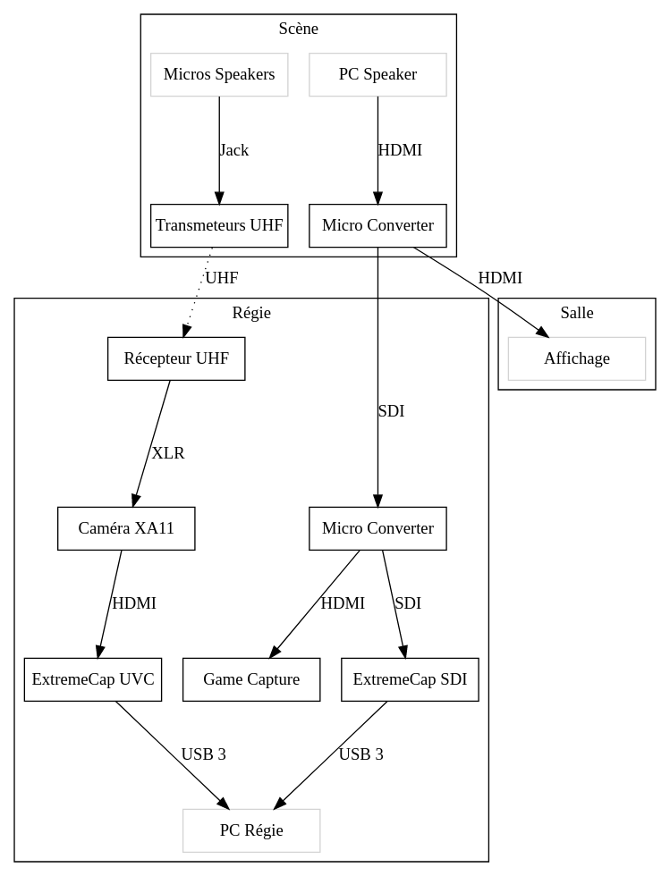
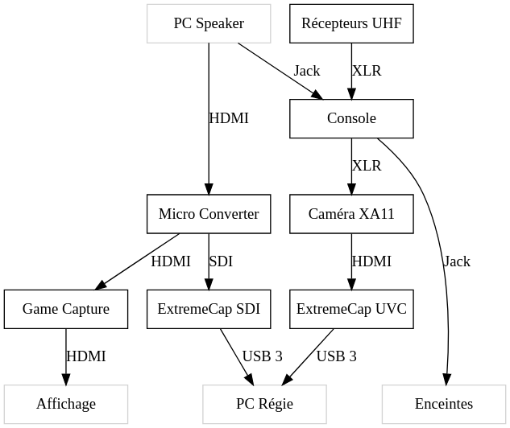
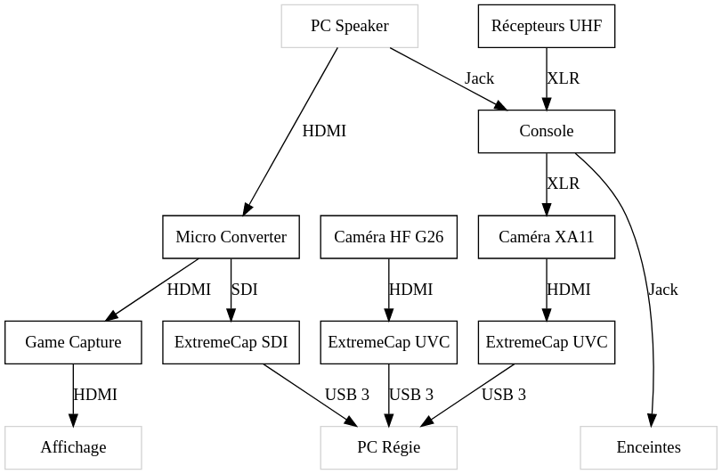

= Installation du matériel de capture

== Minimale

////
[graphviz]
....
digraph G {
    node [shape = rect, fixedsize = true, width = 1.6]

    Speaker [label = "PC Speaker", color = "lightgrey"]

    {
        rank = same
        Affichage [color = "lightgrey"]
        Regie [label = "PC Régie", color = "lightgrey"]
    }

    MC [label = "Micro Converter"]
    GC [label = "Game Capture"]
    ECS [label = "ExtremeCap SDI"]
    ECU1 [label = "ExtremeCap UVC"]
    XA11 [label = "Caméra XA11"]
    Rx [label = "Récepteur UHF"]

    Speaker -> MC -> GC -> Affichage [label = "HDMI"]
    MC -> ECS [label = "SDI"]
    ECS -> Regie [label = "USB 3"]
    Rx -> XA11 [label = "XLR"]
    XA11 -> ECU1 [label = "HDMI"]
    ECU1 -> Regie [label = "USB 3"]
}
....
////

== Avec retour son

////
 [graphviz]
....
digraph G {
    node [shape = rect fixedsize = true width = 1.6]

    Speaker [label = "PC Speaker", color = "lightgrey"]

    {
        rank = same
        Affichage [color = "lightgrey"]
        Enceintes [color = "lightgrey"]
        Regie [label = "PC Régie", color = "lightgrey"]
    }

    MC [label = "Micro Converter"]
    GC [label = "Game Capture"]
    ECS [label = "ExtremeCap SDI"]
    ECU1 [label = "ExtremeCap UVC"]
    XA11 [label = "Caméra XA11"]
    Rx [label = "Récepteurs UHF"]
    Cs [label = "Console"]

    Speaker -> MC -> GC -> Affichage [label = "HDMI"]
    MC -> ECS [label = "SDI"]
    ECS -> Regie [label = "USB 3"]
    XA11 -> ECU1 [label = "HDMI"]
    ECU1 -> Regie [label = "USB 3"]
    Rx -> Cs [label = "XLR"]
    Cs -> XA11 [label = "XLR"]
    Speaker -> Cs -> Enceintes [label = "Jack"]
}
....
////

== Complet

////
[graphviz]
....
digraph G {
    node [shape = rect fixedsize = true width = 1.6]

    Speaker [label = "PC Speaker", color = "lightgrey"]

    {
        rank = same
        Affichage [color = "lightgrey"]
        Enceintes [color = "lightgrey"]
        Regie [label = "PC Régie", color = "lightgrey"]
    }

    MC [label = "Micro Converter"]
    GC [label = "Game Capture"]
    ECS [label = "ExtremeCap SDI"]
    ECU1 [label = "ExtremeCap UVC"]
    ECU2 [label = "ExtremeCap UVC"]
    XA11 [label = "Caméra XA11"]
    G26 [label = "Caméra HF G26"]
    Rx [label = "Récepteurs UHF"]
    Cs [label = "Console"]

    Speaker -> MC -> GC -> Affichage [label = "HDMI"]
    MC -> ECS [label = "SDI"]
    ECS -> Regie [label = "USB 3"]
    XA11 -> ECU1 [label = "HDMI"]
    ECU1 -> Regie [label = "USB 3"]
    G26 -> ECU2 [label = "HDMI"]
    ECU2 -> Regie [label = "USB 3"]
    Rx -> Cs [label = "XLR"]
    Cs -> XA11 [label = "XLR"]
    Speaker -> Cs -> Enceintes [label = "Jack"]
}
....
////
