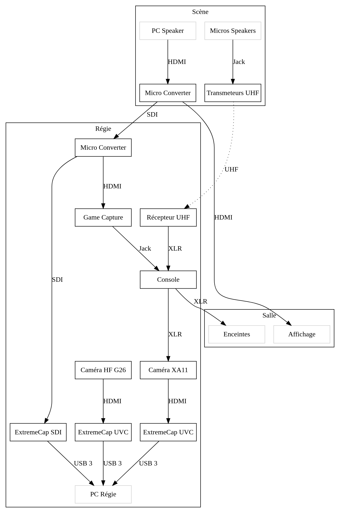

= Installation du matériel de capture

== Minimale

////
[graphviz]
....
digraph G {
    node [shape = rect, fixedsize = true, width = 1.6]

    subgraph cluster_scene {
		label = "Scène"

        Mics [label = "Micros Speakers", color = "lightgrey"]
        Tx [label = "Transmeteurs UHF"]
        PC [label = "PC Speaker", color = "lightgrey"]
        MC1 [label = "Micro Converter"]

        PC -> MC1 [label = "HDMI"]
        Mics -> Tx [label = "Jack"]
	}

    subgraph cluster_regie {
		label = "Régie"

        Regie [label = "PC Régie", color = "lightgrey"]
        MC2 [label = "Micro Converter"]
        GC [label = "Game Capture"]
        XA11 [label = "Caméra XA11"]
        Rx [label = "Récepteur UHF"]
        {
            rank = same
            ECS [label = "ExtremeCap SDI"]
            ECU1 [label = "ExtremeCap UVC"]
        }
        
        MC2 -> GC [label = "HDMI"]
        ECS -> Regie [label = "USB 3"]
        Rx -> XA11 [label = "XLR"]
        XA11 -> ECU1 [label = "HDMI"]
        ECU1 -> Regie [label = "USB 3"]
    }

    
    subgraph cluster_loc {
        label = "Salle"
        
        Affichage [color = "lightgrey"]
    }

    MC1 -> Affichage [label = "HDMI"]
    MC1 -> MC2 -> ECS [label = "SDI"]
    Tx -> Rx [label = "UHF", style = dotted]
}
....
////

== Maximale

////
 [graphviz]
....
digraph G {
    node [shape = rect, fixedsize = true, width = 1.6]

    subgraph cluster_scene {
		label = "Scène"

        Mics [label = "Micros Speakers", color = "lightgrey"]
        Tx [label = "Transmeteurs UHF"]
        PC [label = "PC Speaker", color = "lightgrey"]
        MC1 [label = "Micro Converter"]

        PC -> MC1 [label = "HDMI"]
        Mics -> Tx [label = "Jack"]
	}

    subgraph cluster_regie {
		label = "Régie"

        Regie [label = "PC Régie", color = "lightgrey"]
        MC2 [label = "Micro Converter"]
        GC [label = "Game Capture"]
        XA11 [label = "Caméra XA11"]
        G26 [label = "Caméra HF G26"]
        Rx [label = "Récepteur UHF"]
        Cs [label = "Console"]
        {
            rank = same
            ECS [label = "ExtremeCap SDI"]
            ECU1 [label = "ExtremeCap UVC"]
            ECU2 [label = "ExtremeCap UVC"]
        }
        
        MC2 -> GC [label = "HDMI"]
        ECS -> Regie [label = "USB 3"]
        Rx -> Cs -> XA11 [label = "XLR"]
        XA11 -> ECU1 [label = "HDMI"]
        G26 -> ECU2 [label = "HDMI"]
        ECU1 -> Regie [label = "USB 3"]
        ECU2 -> Regie [label = "USB 3"]
        GC -> Cs [label = "Jack"]
    }
    
    subgraph cluster_loc {
        label = "Salle"
        
        Affichage [color = "lightgrey"]
        Enceintes [color = "lightgrey"]
    }

    MC1 -> Affichage [label = "HDMI"]
    MC1 -> MC2 -> ECS [label = "SDI"]
    Tx -> Rx [label = "UHF", style = dotted]
    Cs -> Enceintes [label = "XLR"]
}
....
////
